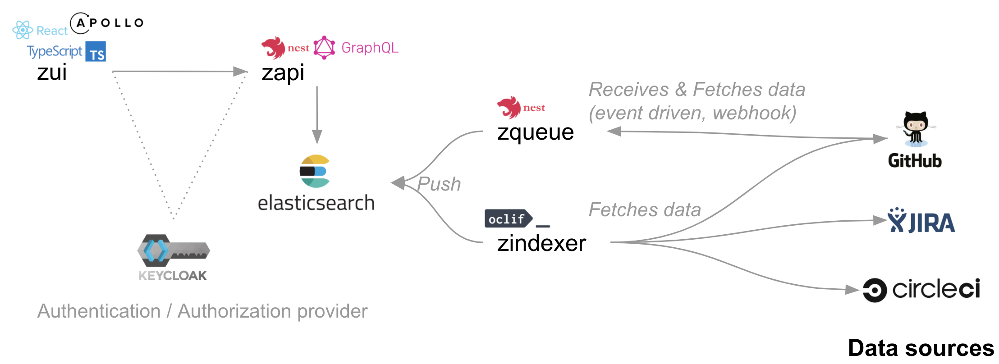

ZenCrepes architecture is fairly straight forward, it fetches data from remote sources, pushes it to a data store and display everything with a UI.

A ZenCrepes deployment is made of the following services:

- **zindexer**: A bulk data fetcher
- **zqueue**: A event driven data fetcher (to be implemented)
- **Elasticsearch**: The datastore
- **zapi**: A GraphQL API linking the UI to the datastore
- **zui**: The user interface
- **Keycloak**: An authentication/authorization provider (optional)

All services are meant to be running in Docker, corresponding containers are available on [Docker Hub](https://hub.docker.com/orgs/zencrepes/repositories).

## Zindexer

Zindexer is a CLI tool created to fetch data, in bulk, from many sources (it plays gently with GitHub API and follow rate limits). Data is then pushed to an Elasticsearch cluster.

For those using ZenCrepes primariraly with GitHub, zindexer is only really useful during initial setup, it will provision the Elasticsearch cluster with any historical data. Following the initial fetch, `zqueue` would take over and push nodes updates whenever they happen.
For the other data sources, in the absence of web-hooks, zindxer can be cron'd to fetch additional data at regular interval.

A couple of things worth noting:

- The node ID (an Issue, a project, a milestone) is ported over from the data source to the elasticsearch index, which prevents duplicated data. For example if `zqueue` receives an update for a node that was previously imported by `zindexer`, this node will be updated.
- Whenever possible (depending of the data source API characteristics), nodes are fetched sorted by last update date (descending), when the system fetch an issue that is already present and has the same late update date, it knows it can stop fetching further nodes.

## Zqueue

Zqueue is a queue aimed at processing events received after registering a webhook with GitHub.

It contains three Redis queues:

- **github**: Limited to processing one queue element at a time and per second (to play nicely with [GitHub rate limits](https://developer.github.com/v3/#rate-limiting)), this queue initiates a call to GitHub to fetch additional metadata, not included in the webhook payload. The objective here is to reach content parity with nodes fetches using [Zindexer](http://github.com/zencrepes/zindexer).
- **storepayload**: Pushes the payload to an elasticsearch index (one index per payload type) while trying to keep only one document per github node (overwrite on update). It aims at providing the latest state of a node.
- **storerawpayload**: Pushes the payload to an elasticsearch index (one index per payload type) and record the date at which the event was received. It aims at providing a timeline view of nodes lifecycle.

`storepayload` and `storerawpayload` are mostly there for those willing to diving in their data using a tool like Kibana or to archive GitHub events on their organization. ZenCrepes doesn't try to access datasets processed through these two queues.

## Elasticsearch

Elasticsearch is the datastore for the project, two options are available for indices:

- One index per data source and data type (all GitHub issues, all Jira issues, ...)
- One index per data repository, data source and data type, using index aliases for querying.

Cluster sizing is not going to be discussed in this documentation, there are many resources available online covering this topic.

## Zapi

Zapi is a GraphQL api providing an interface between the Elasticsearch datastore and our UI. It supports querying through an abstraction language called [SQON](https://arranger.readthedocs.io/en/latest/src/sqon.html) and supports pagination, aggregations and various ZenCrepes-specific operations.

## Zui

Zui is ZenCrepes front-end, nothing particular to mention about it. It interacts primariraly with Zapi, and will (not implemented yet) in some occurences communicate directly with the data source (GitHub in particular) for bulk operations (if authentication/authorization is set-up properly).

## Keycloak

[Keycloak](https://www.keycloak.org/) is an identify and access management solution, it is used to control access to the data. Keycloak can be disabled through environment variables, although this usecase is only recommended during development.
