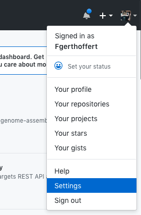
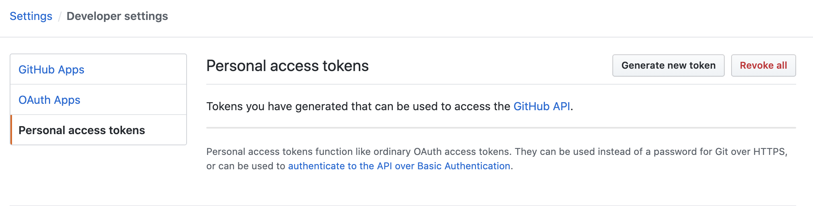

This section of the documentation contains instructions to get started quickly using `docker` and `docker-compose`. This doesn't aim at providing instructions to install a production-grade environment, but to take the shortest path to a running ZenCrepes environment.

This documentation has been tested on Mac, instructions should be identical on GNU/Linux.

## Obtain a GitHub developer token

Log-in your profile in GitHub, and go to your settings.



In the left-side menu, click on `Developer settings` at the bottom.



Then select `Personal access tokens` and `Generate new token`.

Give your token a name, and select the following scopes:

- repo
- admin:org

Those scopes should be sufficient to get started, click on `Generate token` and keep this token safe (don't share it!).

## Clone the repo

```bash
mkdir ~/zencrepes
cd ~/zencrepes
git clone git@github.com:zencrepes/docker.git
cd docker
mkdir /tmp/zencrepes-data
docker-compose up -d
```

PS: `/tmp/zencrepes-data` is where the configuration file and cache data will be stored, if you whish to use a different directory, you'll need to update the `docker-compose.yml` file.

ZenCrepes is now available at http://localhost:8080 but hasn't been configured yet ! At that point you should be able to access it, but the left-side menu will be mostly empty.

## Configure ZenCrepes

Data will be fetched by [zindexer](https://github.com/zencrepes/zindexer). During its initial startup, the tool generated a blank configuration file you will need to modify.

Open-up `/tmp/zencrepes-data/config.yml`, and modify the following elements:

```yml
elasticsearch:
  host: 'http://elasticsearch:9200'
github:
  username: YOUR_GITHUB_USERNAME
  token: THE_TOKEN_YOU_GOT_AT_THE_BEGINNING_OF_THIS_DOC
```

For the elasticsearch host, use `http://elasticsearch:9200` as this corresponds to the setup with docker-compose. Leave all the other settings as-is.

## Enable repositories

To facilite discovery (and limit dependencies to external tools), zindexer (which is a CLI tool) has been dockerized, and a small (hugly?) [hack](https://github.com/zencrepes/zindexer/blob/master/startup.sh) was done to ensure this process doesn't shut down, keeping the Docker container alive. This will allow you to interact with the command tool without needing to have node and npm running on your machine.

The first step is to identify repositories to load data from (those are called `sources` in ZenCrepes).

Run the following command:

```bash
docker exec -it zindexer zindexer sources --help
```

This gives view a quick view at the available commands, which ultimately define what data will be fetched.

<Note type="tip">
Yes, there needs to be two `zindexer` in the command above, the first one is the docker container name, while the second one is the command to run within that container.
</Note>

To get started quickly, with as much data as possible, run the following command:

```bash
docker exec -it zindexer zindexer sources -a -g affiliated
```

This will enable all repositories from all GitHub organizations affiliated with your account. But be careful, that could represent a lot of data !

## Fetch Pull Requests

Although `zindexer` will give you access to a lot of entities (issues, projects, milestones, ...), the only datasource useful in the context of discovery are `pull requests`, the other ones are expected to be unstable as development on ZenCrepes continues.

To fetch all pull requests, from all repositories, run the following command:

```bash
docker exec -it zindexer zindexer github:pullrequests
```

Data is fetched per repository, once a repository has been fully loaded its data becomes available in ZenCrepes. So if you are fetching a lot of data, you don't need to wait until the end to start playing with the tool.

## Important notes

Authentication/Authorization is not enabled, so pay attention to where you are spinning up this environment.

Don't run zindexer multiple times in parallel. If you do that you will hit GitHub rate throttling. On top of that, it's in everyone best interest to play gently with GitHub API.

GitHub will issue 5000 tokens per 1-hour period, which should be plenty for most discovery situations. You can monitor token consumption while `zindexer` is running, by watching for the following messages:

```
GitHub Tokens - remaining: 3724 query cost: 1 (token will reset at: 2020-04-29T04:18:44Z)
```

ZenCrepes will pause data loading, until token reset, if you do consume all tokens.

If you re-run the command later on, `zindexer` will only fetch newly updated PRs.

On the long-run, `zindexer` will only be useful for the initial data fetching (historical data). another tool `zqueue` (not built yet), will take care of fetching data based on events it will receive from GitHub. `zindexer` is only needed to fetch data, it doesn't need to be running constantly.

That's it, happy discovery !
